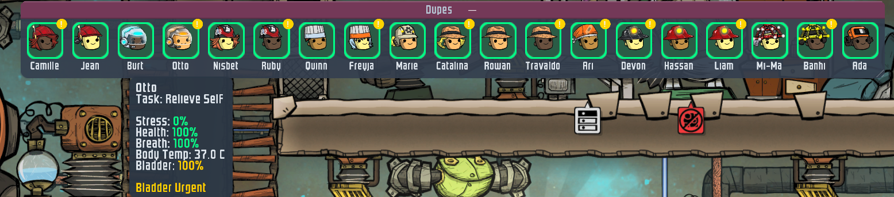

# ONI Mods

Mods for [Oxygen Not Included](https://www.klei.com/games/oxygen-not-included), built with Harmony 2.0 and PLib.



## Mods

### DuplicantStatusBar
RimWorld-style colonist bar — always-visible dupe portraits with stress-colored borders, alert badges, and hover tooltips. Composites portraits directly from KAnim texture atlases.

- Stress tiers: 5-color gradient (green → red) with pulse on critical
- Alerts: suffocating, low HP, scalding, hypothermia, overstressed, diseased, overjoyed
- Auto-shrink when the bar exceeds screen width
- Draggable, collapsible, configurable via PLib options

### ReplaceStuff
Replace existing buildings with upgraded versions without deconstructing first. Supports tiles, doors, ladders, and more — including modded doors.

### BuildThrough
Build and deconstruct through walls. Transpiler-based patching of the offset table to bypass solid cell checks.

### OniProfiler
In-game performance profiler toggled with F8. Instruments 29+ game systems, PlayerLoop phases, bulk Update methods, and coroutine census. Zero overhead when closed.

### GCBudget
Alloc-gated garbage collection — triple-gate system (frame budget, cooldown, alloc threshold) to reduce GC stutter spikes. Proof of concept.

## Building

```bash
dotnet build <ModName>/<ModName>.csproj
```

Requires game DLLs from your ONI installation. See individual `.csproj` files for reference paths.

## License

MIT
